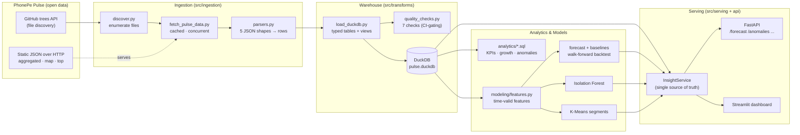

# Architecture

End-to-end flow from the public Pulse dataset to the API and dashboard.

## Key properties

- **Discovery-driven ingestion** — no hard-coded states/quarters; new quarters
  ingest automatically from the file tree.
- **Idempotent warehouse** — tables rebuilt each run; re-runs never duplicate.
- **Leakage-free modeling** — every forecasting feature is strictly lagged;
  validation is walk-forward, never a random split. Enforced by unit tests.
- **One source of truth** — API and dashboard both read `InsightService`, so
  they can never disagree.
- **CI-gated** — `quality_checks` exits non-zero on any FAIL; GitHub Actions runs
  lint + the offline test suite + a Docker image build on every push.

## Deployment

`docker compose up --build` runs a one-shot `pipeline` service to populate a
shared `pulse-data` volume, then starts `api` (:8000) and `dashboard` (:8501),
both depending on the pipeline completing successfully.
